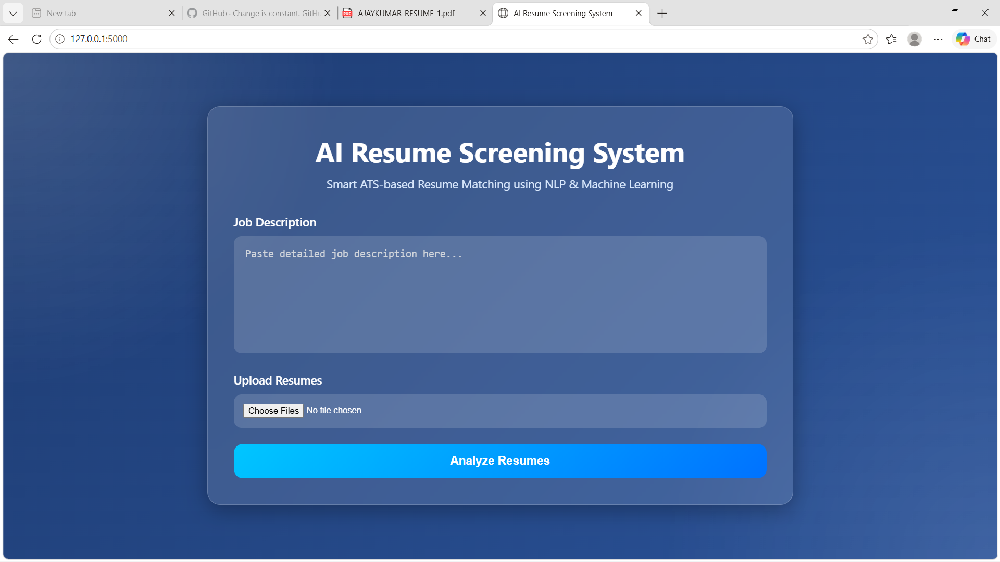

# AI Resume Screening System

An AI-powered ATS Resume Screening Web Application built using Flask, NLP, and Machine Learning.

## 🚀 Features

- Upload PDF & DOCX resumes
- Enter Job Description
- NLP-based resume matching
- ATS score calculation
- Resume ranking system
- Modern responsive UI
- Keyword-based intelligent scoring
- TF-IDF similarity matching

---

# 📸 Project Preview



---

# 🛠 Technologies Used

| Technology | Purpose |
|------------|----------|
| Python | Backend programming |
| Flask | Web framework |
| HTML | Frontend structure |
| CSS | UI styling |
| Scikit-learn | Machine learning algorithms |
| NLP | Text processing |
| TF-IDF | Text vectorization |
| Cosine Similarity | Similarity calculation |
| PDFPlumber | Extract text from PDF |
| Python-Docx | Extract text from DOCX |

---

# 📂 Project Structure

```bash
resume-screening/
│
├── app.py
│
├── uploads/
│
├── templates/
│   └── index.html
│
├── static/
│   └── style.css
│
└── README.md
```

---

# ⚙️ Installation

## Clone Repository

```bash
git clone https://github.com/yourusername/AI-Resume-Screening-System.git
```

---

## Install Dependencies

```bash
pip install flask pdfplumber python-docx scikit-learn
```

---

# ▶️ Run Project

```bash
python app.py
```

Open browser:

```bash
http://127.0.0.1:5000
```

---

# 🧠 How It Works

## Step 1: Upload Resume
Users upload resumes in PDF or DOCX format.

## Step 2: Enter Job Description
Users provide the required job role description.

## Step 3: Resume Text Extraction
The system extracts text from resumes using:
- PDFPlumber
- Python-Docx

## Step 4: NLP Processing
Text is cleaned and processed using NLP techniques.

## Step 5: TF-IDF Vectorization
Converts text into numerical vectors.

## Step 6: Cosine Similarity
Calculates similarity between resume and job description.

## Step 7: Hybrid ATS Scoring
Combines:
- TF-IDF score
- Keyword matching
- Bonus skill boosting

## Step 8: Display Results
Resumes are ranked based on ATS match percentage.

---

# 📦 Packages Used

## 1. Flask

### Purpose:
Used to create the web application backend and routes.

### Used For:
- Handling requests
- Rendering HTML pages
- Managing file uploads

### Import:
```python
from flask import Flask, render_template, request
```

---

## 2. Scikit-learn

### Purpose:
Machine Learning library used for NLP similarity calculations.

### Used For:
- TF-IDF Vectorization
- Cosine Similarity

### Import:
```python
from sklearn.feature_extraction.text import TfidfVectorizer
from sklearn.metrics.pairwise import cosine_similarity
```

---

## 3. PDFPlumber

### Purpose:
Extracts text content from PDF resumes.

### Import:
```python
import pdfplumber
```

---

## 4. Python-Docx

### Purpose:
Reads and extracts text from DOCX resumes.

### Import:
```python
import docx
```

---

## 5. Regular Expressions (re)

### Purpose:
Used for text cleaning and preprocessing.

### Used For:
- Removing special characters
- Lowercase conversion
- Cleaning unwanted spaces

### Import:
```python
import re
```

---

# 🧮 Machine Learning Concepts Used

## TF-IDF Vectorization

TF-IDF converts text into numerical vectors based on word importance.

### Full Form:
Term Frequency - Inverse Document Frequency

### Purpose:
Identify important keywords in resumes and job descriptions.

---

## Cosine Similarity

Measures similarity between two text vectors.

### Formula:

Cosine Similarity = (A · B) / (||A|| ||B||)

### Purpose:
Calculate how closely a resume matches a job description.

---

# 🎯 Advantages

- Automates resume shortlisting
- Saves recruiter time
- ATS-like matching system
- Supports multiple resume formats
- Easy-to-use interface

---

# 🔥 Future Improvements

- AI semantic matching
- Resume keyword highlighting
- Resume improvement suggestions
- Login/Register system
- MongoDB database
- Admin dashboard
- Drag & drop upload
- Dark mode UI

---

# 👨‍💻 Author

Durgam Ajaykumar

- GitHub: https://github.com/Ajaykumar-8
- LinkedIn: https://www.linkedin.com/in/ajay-durgam-b7260b35b?utm_source=share&utm_campaign=share_via&utm_content=profile&utm_medium=android_app
